# ECE 

**Major: Cybersecurity International**  

---

**Course**  
*Sécurité des Containers*

**Lab Report**  
Session 1

**Instructor**  
Etienne LOUTSCH

**Group Members**  
- ARDILLON Bastian
- SAVEAUX Octave
- BRULEY Martin


**Date**  
February 4, 2026

---
<div style="page-break-after: always;"></div>


## Introduction à la sécurité des containers


### Activités Pratiques

#### Q1 Lancer un Container Simple

Nous avons lancé un conteneur de test qui d'appelle hello-world avec la commande suivante :

```bash
docker run --rm hello-world
```

<div align="center">
  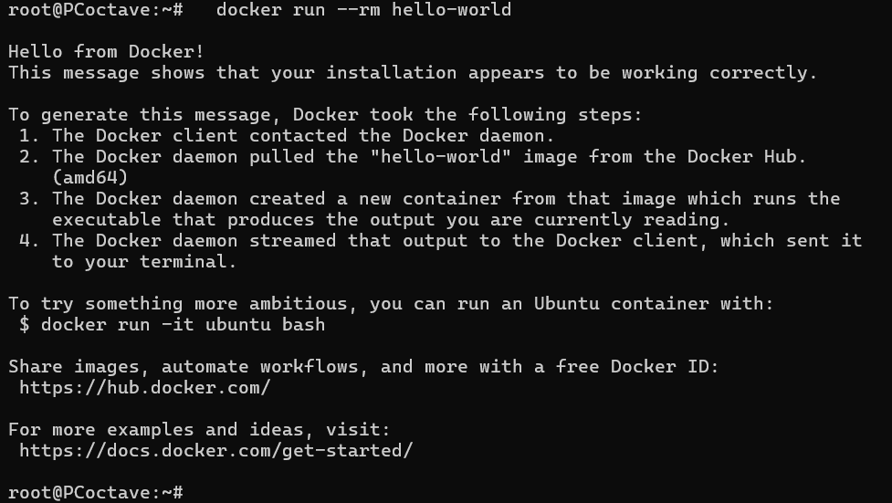
  <p><em>Figure 1: conteneur test hello-world</em></p>
</div>

Cette commande a télécharger l’image `hello-world`, a crée un conteneur, et a executé le programme qui affiche un message de bienvenue, puis supprime le conteneur grâce à l’option `--rm`. Ce test permet de vérifier que Docker est correctement installé et opérationnel.


#### Q2 Explorer un Container en Interactif

Nous avons lancé un conteneur interactif basé sur l’image Alpine avec la commande suivante:

```bash
docker run -it --rm alpine sh
```

<div align="center">
  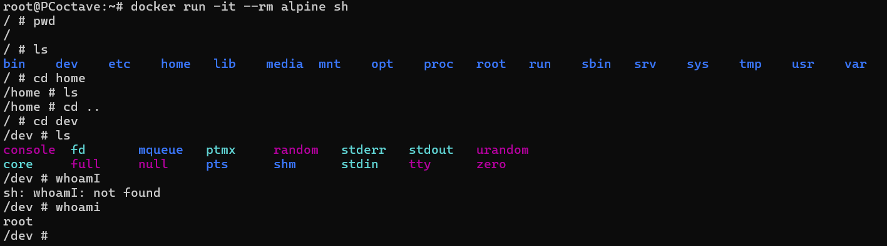
  <p><em>Figure 2: exploration du conteneur Alpine en mode interactif</em></p>
</div>


Les options `-it` permettent d’ouvrir un shell interactif à l’intérieur du conteneur. Nous avons ensuite testé des commandes Linux classiques (dont `ls`, `pwd`, `whoami`, `cd`).


#### Q3 Analyser les ressources système d’un container

Nous avons lancé un conteneur nginx en arrière-plan puis nous avons affiché ses ressources avec les commandes suivantes:

```bash
docker run -d --name test-container nginx
docker stats test-container
```

<div align="center">
  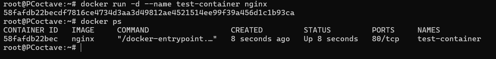
  <p><em>Figure 3: lancement du conteneur nginx en arrière-plan</em></p>
</div>

<div align="center">
  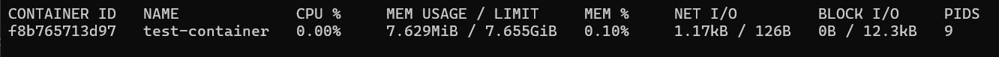
  <p><em>Figure 4: affichage des ressources du conteneur nginx</em></p>
</div>


L’option `-d` exécute le conteneur en arrière-plan, l'option `--name` permet de lui donner un nom. La commande `docker stats` affiche en temps réel la consommation CPU, la mémoire utilisée, l’utilisation réseau, le I/O  et le PID du conteneur.
On constate que le conteneur nginx consomme 7.6 MB de RAM et 0.00% de CPU. Ce conteneur est donc assez léger.

*On constate que même un conteneur léger comme Nginx consomme de la RAM et un peu de CPU. Le suivi des ressources permet de détecter des fuites mémoire ou une surcharge et d’ajuster les limites (mémoire, CPU) si nécessaire pour la sécurité et la stabilité de l’hôte.*


#### Q4 Lister les capacités d’un container

Pour vérifier les capacités du processus dans le conteneur nous avons utilisé la commande suivante:

```bash
docker run --rm --cap-add=SYS_ADMIN alpine sh -c 'cat /proc/self/status | grep Cap'
```
<div align="center">
  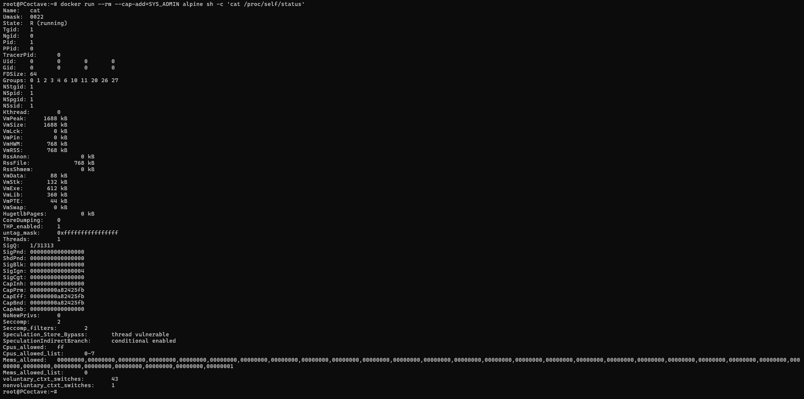
  <p><em>Figure 4: capacités Linux visibles dans /proc/self/status</em></p>
</div>

*il faudrait mettre des infos en plus mais vasy jsp quoi mettre a part avec ai*


## Vulnérabilités et Menaces

### Activités Pratiques

#### Q1 Tester un Container avec des Permissions Élevées

Nous avons lancé un conteneur en mode privilégié avec la commande suivante:

```bash
docker run --rm --privileged alpine sh -c 'echo hello from privileged mode'
```

<div align="center">
  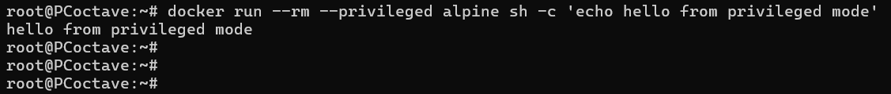
  <p><em>Figure 5: conteneur en mode privilégié</em></p>
</div>

<div align="center">
  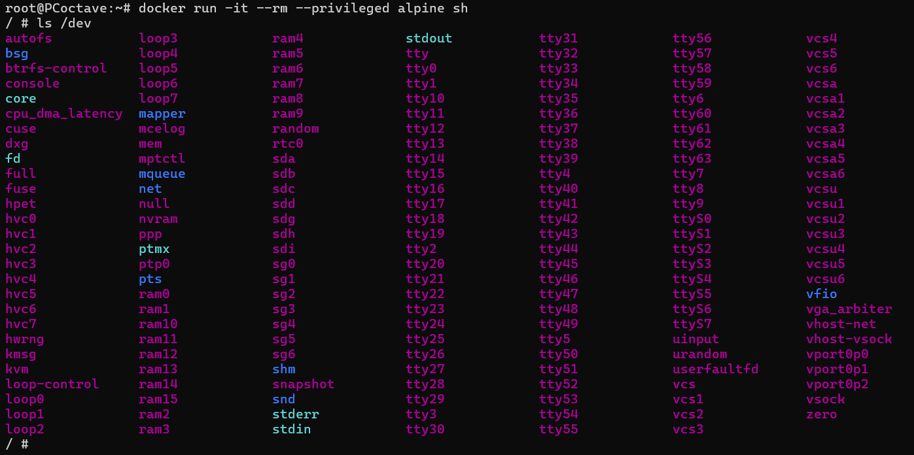
  <p><em>Figure 6: "ls /dev" dans un conteneur privilégié</em></p>
</div>

Pour voir pourquoi cette pratique est dangereuse, nous avons comparé avec un conteneur classique. Dans un conteneur lancé en privilégié, la commande `ls /dev` affiche une liste très longue de devices de l’hôte (disques `sda`, `sdb`, devices loop, RAM, `kvm`), le conteneur a donc accès au matériel et aux interfaces noyau de la machine hôte, ce qui est tres dangereux.

<div align="center">
  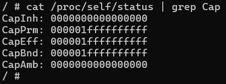
  <p><em>Figure 7: capacités CapPrm, CapEff, CapBnd en mode privilégié</em></p>
</div>

De même, `cat /proc/self/status | grep Cap` montre que les capacités CapPrm, CapEff et CapBnd sont quasi au maximum (valeur hexadécimale `000001ffffffffff`), le processus dispose donc de presque toutes les capacités Linux. Un attaquant qui compromet ce conteneur peut ainsi accéder aux disques, à la mémoire ou au noyau de l’hôte.


#### Q2 Simuler une Évasion de Container

Nous avons lancé un conteneur et monté le système de fichiers de l’hôte dans le conteneur avec la commande suivante:

```bash
docker run --rm -v /:/mnt alpine sh -c 'ls /mnt'
```

<div align="center">
  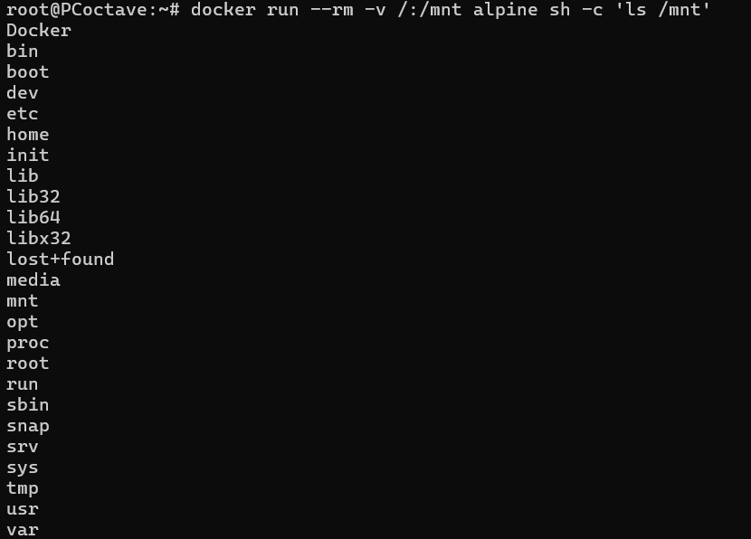
  <p><em>Figure 8: liste du système de fichiers de l’hôte via le montage /:/mnt</em></p>
</div>

Le conteneur voit ainsi l’intégralité du système de fichiers de la machine hôte (répertoires système, home, données sensibles, ...). Un attaquant ayant accès au conteneur peut lire et écrire les fichiers de l’hôte, installer des backdoors, voler des secrets ou des clés. Pour limiter le risque, on peut monter en lecture seule avec `:ro`, ce qui permet au conteneur de voir le système de fichiers de l’hôte mais empêche toute écriture.

<div align="center">
  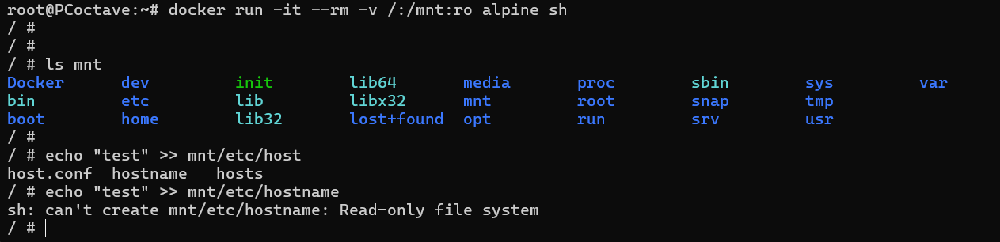
  <p><em>Figure 9: liste du système de fichiers de l’hôte via le montage /:/mnt en lecture seule</em></p>
</div>  


#### Q3 Créer une Image Sécurisée

Nous avons créé un Dockerfile minimaliste avec `nano Dockerfile`, puis construit et exécuté l’image comme suit.


```dockerfile
FROM alpine
RUN adduser -D appuser
USER appuser
CMD ["echo", "Container sécurisé!"]
```

Construction de l’image et affichage de l’id et de l’uid de l’utilisateur:
```bash
docker build -t secure-alpine
docker run --rm secure-alpine sh -c 'echo Container Secu && id'
```
<div align="center">
  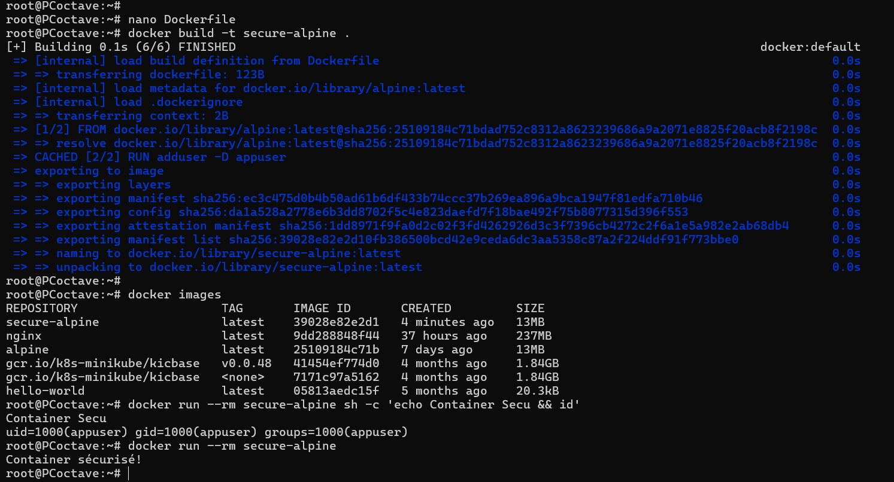
  <p><em>Figure 9: construction de secure-alpine, affichage de l’id/uid de appuser et exécution du CMD</em></p>
</div>

Quand on lance le conteneur, il affiche que l’utilisateur actif s’appelle "appuser" avec l’identifiant 1000. Ensuite, le message "Container sécurisé!" apparaît. Utiliser un utilisateur qui n’est pas root rend le conteneur plus sûr, car même si quelqu’un arrive à l’attaquer, il n’aura pas tous les pouvoirs de droits root dans le conteneur.


### Restreindre l’accès réseau d’un container


#### Q5 Bloquer la connexion internet dans un container
#### Q6 Tester l’accès internet avec par exemple ping google.com

Pour bloquer la connexion Internet d’un conteneur, on utilise la déconnexion du réseau bridge : 

```bash
docker network disconnect bridge mon-container
```

<div align="center">
  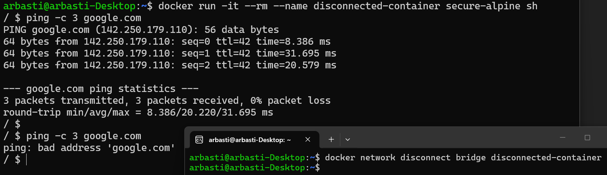
  <p><em>Figure 11: blocage de l’accès Internet par déconnexion du bridge</em></p>
</div>

Le conteneur n’a plus d’interface connectée au réseau bridge et ne peut plus atteindre l’extérieur. La connexion Internet est ainsi bloquée.


#### Q7 Télécharger et Scanner une Image

Nous avons téléchargé une image volontairement vulnérable puis l’avons analysée avec Trivy :

```bash
docker pull vulnerables/web-dvwa
trivy image vulnerables/web-dvwa -f json -o trivy_report.json
```

L’image `vulnerables/web-dvwa` est une application web d’entraînement aux failles (DVWA). Trivy scanne les couches de l’image (OS et dépendances) et détecte les CVE connues. L’option `-f json -o trivy_report.json` enregistre le rapport au format JSON pour exploitation ultérieure.

Pour obtenir un résumé par niveau de sévérité à partir du rapport JSON :

```bash
cat trivy_report.json | jq '.Results[].Vulnerabilities[] | .Severity' | sort | uniq -c
```

**Résumé des vulnérabilités de cette image :** le comptage par sévérité donne notamment : 254 CRITICAL, 551 HIGH, 642 MEDIUM, 116 LOW et 12 UNKNOWN. L’image présente donc un nombre très élevé de failles connues. Une image de ce type ne doit pas être utilisée en production ; elle sert à tester les outils de scan (Trivy, Grype) et à prendre conscience de l’importance d’analyser les images avant déploiement.

<div align="center">
  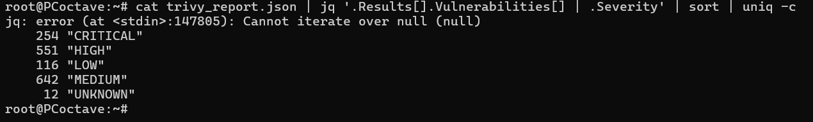
  <p><em>Figure 12: comptage des vulnérabilités par sévérité à partir de trivy_report.json</em></p>
</div>

#### Q8 Scanner une Image pour Détecter les Vulnérabilités

Nous avons analysé une image avec Grype ( un scanneur de vulnérabilités) :

```bash
grype alpine:latest
```

<div align="center">
  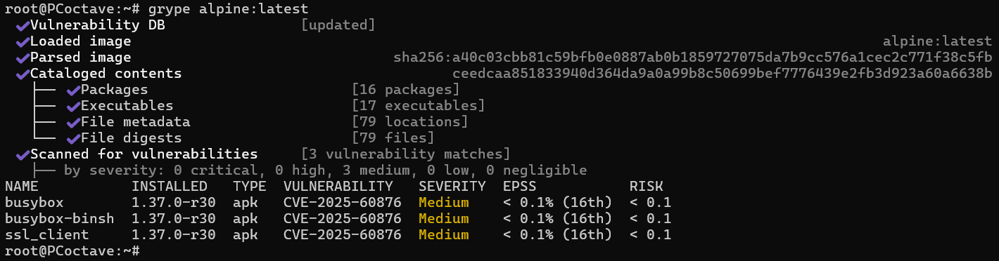
  <p><em>Figure 13: analyse de l’image avec Grype</em></p>
</div>

Grype affiche les CVE détectées dans les packages de l’image. 

**Différences entre Grype et Trivy :**
- **Bases de données :** Grype s’appuie sur la base Anchore alors que Trivy utilise sa propre base. Les listes de CVE et les niveaux de sévérité peuvent légèrement différer.
- **Formats de sortie :** Trivy propose de nombreux formats (table, JSON, SARIF, etc.) et une option `-f json -o fichier` pratique pour automatisation. Grype offre aussi du JSON et une sortie en tableau.
- **Usage :** Les deux permettent de scanner des images Docker, des fichiers, des répertoires. Trivy est souvent utilisé pour l’intégration CI/CD et Grype fait partie de l’écosystème Anchore/Syft.
- **Couverture :** Grype est plus rapide et a une couverture plus large, alors que Trivy est plus complet et a une couverture plus restreinte. Il est utile de croiser les deux outils pour une vue plus complète.


#### Q9 Dockerfile - Run as User

Nous avons créé un Dockerfile avec un utilisateur dédié pour une application Node.js dans le répertoire `~/node-app` :

```dockerfile
FROM node:18-alpine
WORKDIR /app
RUN addgroup -S appgroup && adduser -S appuser -G appgroup
COPY . .
RUN chown -R appuser:appgroup /app
USER appuser
CMD ["node", "app.js"]
```


Le conteneur affiche la sortie de l’application. Pour vérifier que le processus ne tourne pas en root, nous sommes entrés dans le conteneur et avons lancé `whoami && id`. La sortie est `appuser` puis `uid=100(appuser) gid=101(appgroup) groups=101(appgroup)` : l’UID est 100 et le GID 101, ce qui confirme l’exécution sous l’utilisateur dédié.

<div align="center">
  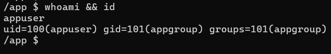
  <p><em>Figure 14: vérification de l’utilisateur (whoami && id) — appuser, uid=100, gid=101</em></p>
</div>

Après construction de l’image (`docker build -t node-app-secure .`), nous avons exécuté le conteneur :

```bash
docker run --rm node-app-secure
```

Le screenshot ci-dessous montre l’exécution de cette commande depuis l’hôte : le conteneur démarre correctement et affiche la sortie de l’application : `test`.

<div align="center">
  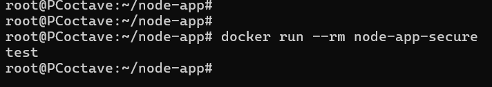
  <p><em>Figure 15: exécution de <code>docker run --rm node-app-secure</code> (sortie : test)</em></p>
</div>


#### Q10 Dockerfile - Run light!

Nous avons créé deux Dockerfiles pour une application en Golang qui affiche du texte.

**Premier Dockerfile :**
```dockerfile
FROM golang:1.19 AS builder
WORKDIR /app
COPY main.go .
RUN go build -o monapp main.go
FROM gcr.io/distroless/static-debian12
COPY --from=builder /app/monapp /
CMD ["/monapp"]
```
Le build se fait dans une image Go, puis seul le binaire est copié dans une image Distroless.

**Deuxième Dockerfile :**
```dockerfile
FROM golang:1.19
WORKDIR /app
COPY main.go .
RUN go build -o monapp main.go
CMD ["./monapp"]
```
Toute l’image reste basée sur Golang, ce qui donne une image beaucoup plus lourde.

**Comparaison des tailles :** Après construction des deux images, la commande `docker images` exécutée depuis `~/go-app` donne notamment : **go-app-full** ≈ **1,53 Go** et **go-app-light** ≈ **9,15 Mo**. La version multi-stage avec Distroless réduit fortement la taille et la surface d’attaque. Les deux conteneurs ont été exécutés et affichent correctement le message de l’application.

