# ECE 

**Major: Cybersecurity International**  

---

**Course**  
*Sécurité des Containers*

**Lab Report**  
Session 2

**Instructor**  
Etienne LOUTSCH

**Group Members**  
- ARDILLON Bastian
- SAVEAUX Octave
- BRULEY Martin


**Date**  
February 25, 2026

---
<div style="page-break-after: always;"></div>


# Session 2 : Bonnes Pratiques de Sécurité

## Gestion des Réseaux et des Secrets

### Sécurisation Réseau

#### **1. Utilisation de réseaux Docker isolés :**

```bash
docker network create --driver bridge secure-net
```

<div align="center">
  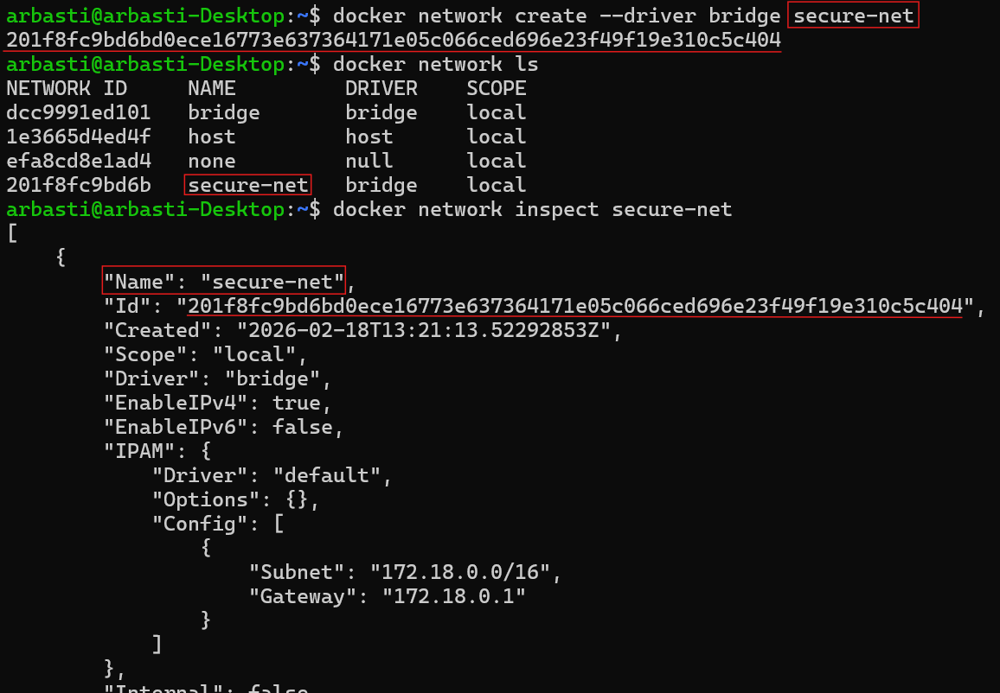
  <p><em>Figure 0: Création d'un réseau Docker bridge isolé</em></p>
</div>

La création d'un réseau Docker dédié permet d'isoler les communications entre containers. Ceci va limite l'exposition au réseau externe et réduire la surface d'attaque


---
<div style="page-break-after: always;"></div>


### Gestion des Secrets

#### **1. Éviter l’Exposition Involontaire de Ports**

Nous lançons un container avec un port exposé :
```bash
docker run -d -p 8080:80 nginx
```

And we check if the port is exposed using `netstat` or `ss` :

<div align="center">
  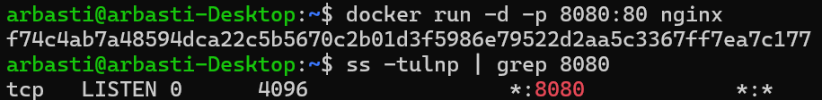
  <p><em>Figure 1: Vérification des ports exposés</em><
</div>

L'exposition de ports rend un service accessible depuis l'extérieur. Les ports doivent être contrôlée pour éviter des accès non autorisés

---

#### **2. Restreindre les permissions d’accès aux fichiers sensibles**

Nous montons un fichier sensible en lecture seule :
```bash
docker run -it --rm -v /etc/passwd:/mnt/passwd:ro alpine sh
```

<div align="center">
  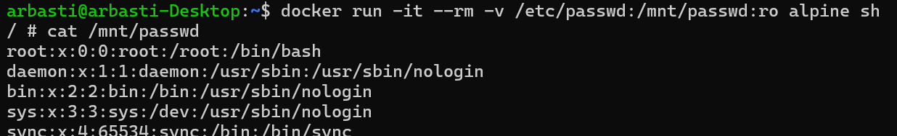
  <p><em>Figure 2: Accès en lecture seule à un fichier sensible dans le container</em></p>
</div>

Maintenant essayons de modifier le fichier

<div align="center">
  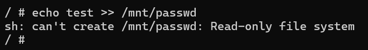
  <p><em>Figure 3: Écriture refusée sur un fichier monté en lecture seule</em></p>
</div>

L'utilisation du mode lecture seule empêche toute modification du fichier `/mnt/passwd`


---
<div style="page-break-after: always;"></div>


#### **3. Auditer la configuration d’un container avec Docker Bench**

Nous installons et exécutons Docker Bench for Security :
```bash
git clone https://github.com/docker/docker-bench-security.git
cd docker-bench-security/
```

L'audit sur l'hôte va nous donner un score de securité basé sur des vérifications (passed/failed)

<div align="center">
  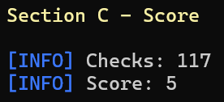
  <p><em>Figure 4: Résultats de l'audit de sécurité sur l'hôte</em></p>
</div>

Nous auditons également un container vulnérable (`vulnerables/web-dvwa`) :

<div align="center">
  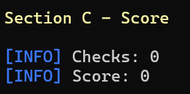
  <p><em>Figure 5: Résultats d'audit sur un container volontairement vulnérable</em></p>
</div>

La majorité des vérifications échouent car le container est volontairement mal sécurisé, nous affichant des erreurs classiques (ports exposés, permissions faibles, logiciels obsolètes).


---
<div style="page-break-after: always;"></div>


#### **4. Stocker et Utiliser des Secrets**

- Lancer un container Vault :

Nous lançons un container Vault en server mode avec la command suivante :
```bash
docker run --cap-add=IPC_LOCK -e 'VAULT_LOCAL_CONFIG={"storage": {"file": {"path": "/vault/file"}}, "listener": [{"tcp": { "address": "0.0.0.0:8200", "tls_disable": true}}], "default_lease_ttl": "168h", "max_lease_ttl": "720h", "ui": true}' -p 8200:8200 hashicorp/vault server
```

<div align="center">
  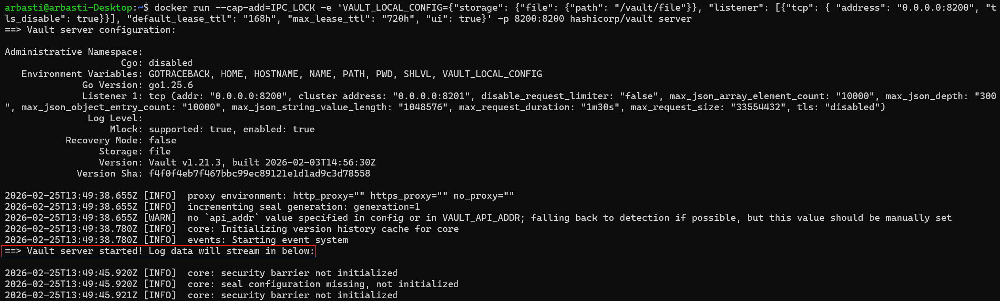
  <p><em>Figure 6: Lancement du serveur Vault dans un container</em></p>
</div>

La commande utilisé lance un serveur Vault avec un stockage local et une interface web activée. L'option `IPC_LOCK` empêche l'écriture des données sensibles sur disque

Nous vérifions que le container tourne correctement :
```bash
docker ps
```

<div align="center">
  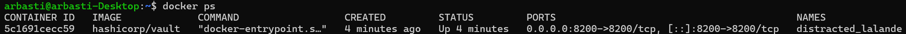
  <p><em>Figure 7: Vérification que le container Vault est en cours d'exécution</em></p>
</div>

<div style="page-break-after: always;"></div>

Passons à l'initialisation et dévérouillage du Vault :
```bash
docker exec -it distracted_lalande vault operator init -key-shares=1 -key-threshold=1
```

On rajoute les options :
- -key-shares=1 : ceci générera une seule clé
- -key-threshold=1 : nous aurons besoin que d'une clé pour dévérouiller le Vault à l'avenir

<div align="center">
  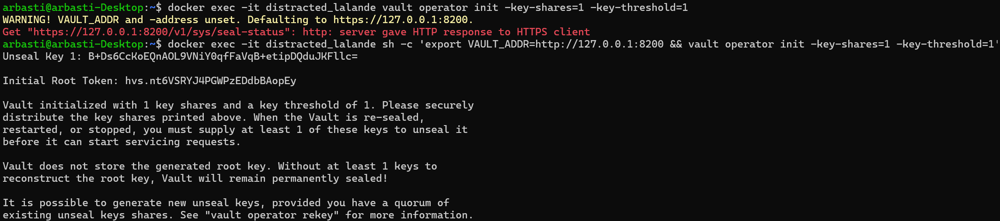
  <p><em>Figure 8: Initialisation du Vault et génération des clés</em></p>
</div>

`VAULT_ADDR=http://127.0.0.1:8200` permet de définir l'adresse du serveur Vault utilisé par la CLI
```bash
docker exec -it distracted_lalande sh -c 'export VAULT_ADDR=http://127.0.0.1:8200 && vault operator init -key-shares=1 -key-threshold=1'
```

Déverrouillons le Vault :
```bash
docker exec -it distracted_lalande sh -c 'export VAULT_ADDR=http://127.0.0.1:8200 && vault operator unseal B+Ds6CcKoEQnAOL9VNiY0qfFaVqB+etipDQduJKFllc='
```

Vue que nous avons rajouté `key-threshold=1` plutôt, nous aurons besoin que d'une clé pour déverrouiller le Vault

<div align="center">
  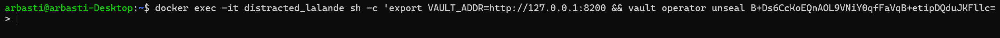
  <p><em>Figure 9: Processus de déverrouillage de Vault</em></p>
</div>

Cette étape est obligatoire car Vault démarre en mode scellé pour protéger les secrets

On peut également vérifier les logs du Vault pour confirmer que celui-ci c'est bien déverouillé :

<div align="center">
  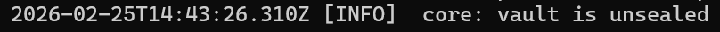
  <p><em>Figure 10: Confirmation dans les logs que Vault est déverrouillé</em></p>
</div>

<div style="page-break-after: always;"></div>

- Se rendre sur l'UI `localhost:8200`, se connecter avec le root-token puis créer un user/mot de passe (on aurait pu utiliser d'autres méthode d'authentification type approle, tls..)

Maintenant nous pouvons nous connecter sur `http://localhost:8200/` avec le `Initial Root Token` reçu plutôt *(Figure 8)*:

<div align="center">
  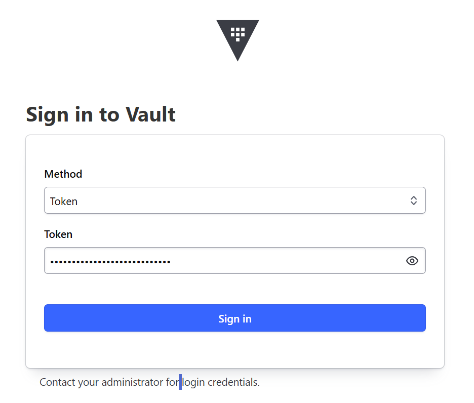
  <p><em>Figure 11: Connexion à Vault avec le token root</em></p>
</div>

Nous sommes maintenant connecté sur `http://localhost:8200/ui/vault/dashboard` :

<div align="center">
  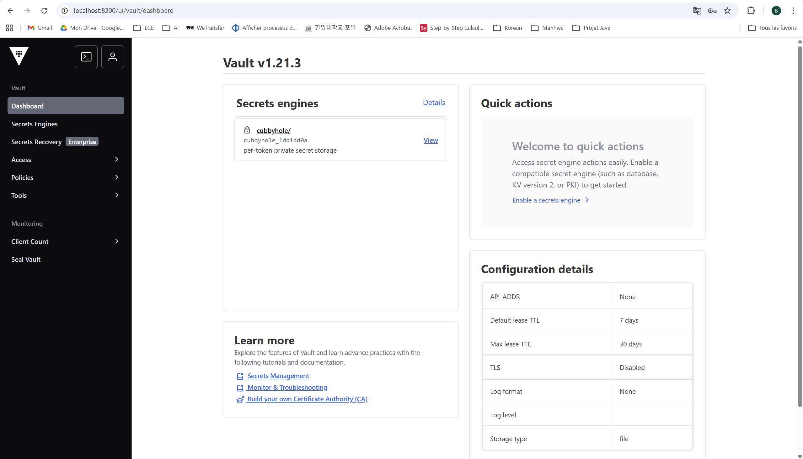
  <p><em>Figure 12: Tableau de bord Vault après authentification</em></p>
</div>

<div style="page-break-after: always;"></div>

Créons un utilisateur sur l'application :

<div align="center">
  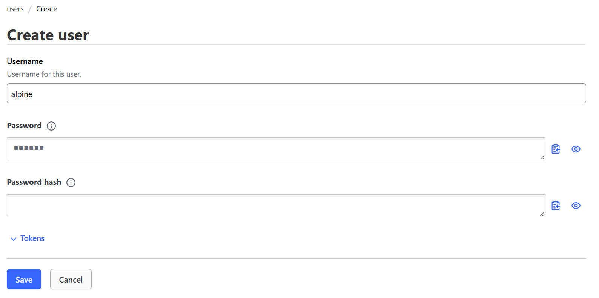
  <p><em>Figure 13: Création d'un utilisateur avec la méthode userpass</em></p>
</div>

- Créer une ACL qui permet de lire un secret au chemin `containers/mon-secret`

<div align="center">
  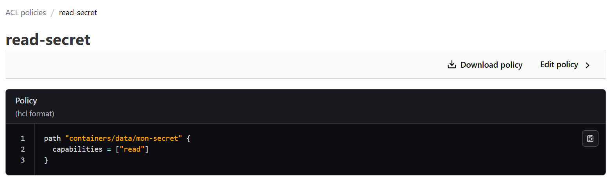
  <p><em>Figure 14: Création d'une politique ACL</em></p>
</div>

Les policies définissent les actions autorisées et sont appliquées lors de la génération de token à la connection de l'utilisateur

<div style="page-break-after: always;"></div>

- Créer un user/mot de passe et associer l'ACL créer auparavant

<div align="center">
  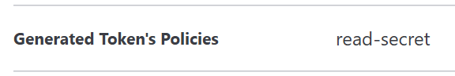
  <p><em>Figure 15: Association d'une policy à un utilisateur</em></p>
</div>

- Créer un secret dans le path `containers/mon-secret`

<div align="center">
  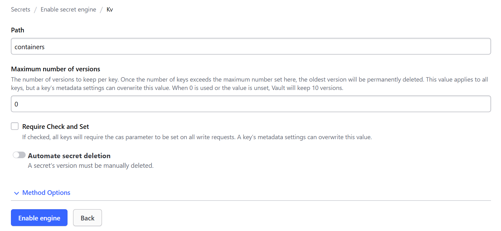
  <p><em>Figure 16: Création du chemin de stockage des secrets</em></p>
</div>

Nous créons un secret `api_key` :

<div align="center">
  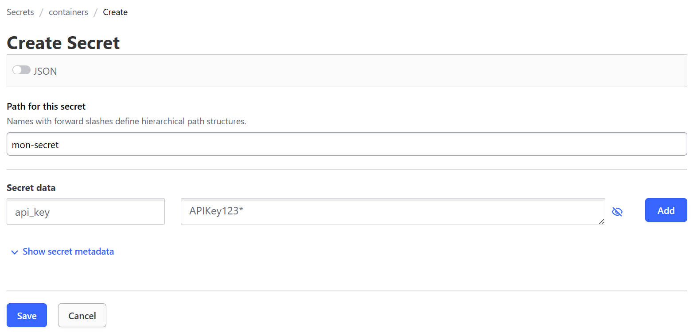
  <p><em>Figure 17: Création d'un secret (clé API)</em></p>
</div>

<div style="page-break-after: always;"></div>

Voici l'overview de notre nouveau secret :

<div align="center">
  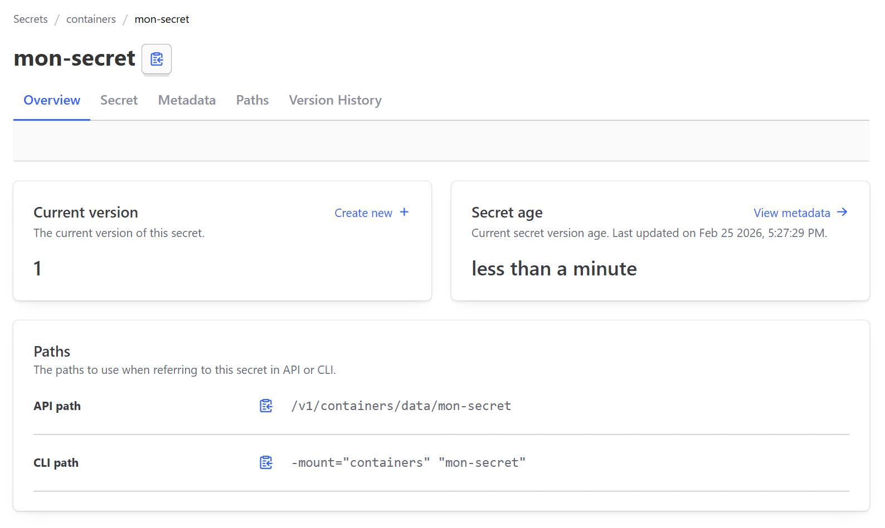
  <p><em>Figure 18: Secret stocké</em></p>
</div>

- Lancer un container alpine et avec l'outil curl faire une authentification au Vault, puis récuperer le secret

```bash
docker run --rm -it alpine sh
apk add --no-cache curl
```

<div align="center">
  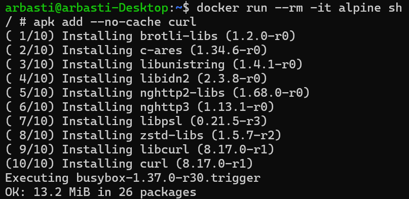
  <p><em>Figure 19: Installation de curl dans un container</em></p>
</div>

<div style="page-break-after: always;"></div>

Authentification :
```bash
export VAULT_ADDR=http://host.docker.internal:8200

TOKEN=$(curl -s \
  --request POST \
  --data '{"password":"alpine"}' \
  $VAULT_ADDR/v1/auth/userpass/login/alpine \
  | grep -o '"client_token":"[^"]*' | cut -d':' -f2 | tr -d '"')

echo $TOKEN
```

<div align="center">
  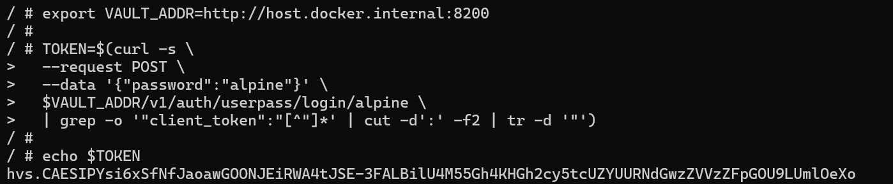
  <p><em>Figure 20: Récupération d'un token d'authentification Vault</em></p>
</div>

Le token permet d'authentifier la requête suivante, qui recupère le secret :
```bash
curl -s -H "X-Vault-Token: $TOKEN" $VAULT_ADDR/v1/containers/data/mon-secret
```

<div align="center">
  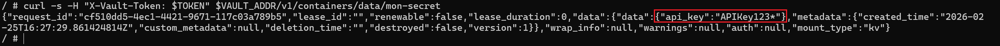
  <p><em>Figure 21: Récupération du secret via l'API Vault</em></p>
</div>


---
<div style="page-break-after: always;"></div>


#### **5. Trouver la clé Contexte : Un développeur pas très habile (moi) à builder une image docker. Celle-ci comporte une clé API utilisé dans une requête assez suspecte... En tant qu'attaquant, trouver la clé API dans l'image docker**

Nous téléchargeons l'image Docker :
```bash
docker pull ety92/demo:v1
```

<div align="center">
  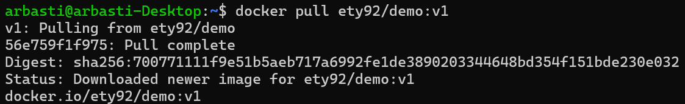
  <p><em>Figure 22: Téléchargement de l'image Docker</em></p>
</div>

En utilisant la commande suivante, nous pouvons inspecter toutes les couches de l'image Docker ainsi que les instructions utilisées lors de sa construction :
```bash
docker history ety92/demo:v1
```

<div align="center">
  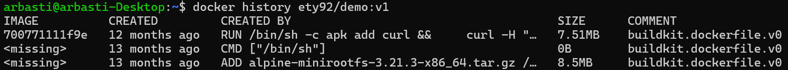
  <p><em>Figure 23: Historique complet de l'image avec les commandes de build</em></p>
</div>

Nous pouvons accéder à l'historique complet de l'image avec la commande suivante :
```bash
docker history ety92/demo:v1 --no-trunc
```

<div align="center">
  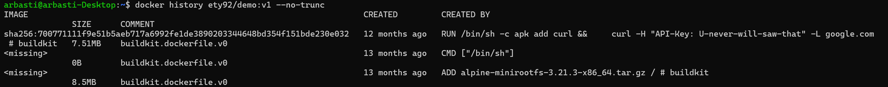
  <p><em>Figure 24: Historique complet de l'image montrant toutes les couches et instructions de build</em></p>
</div>


---

END