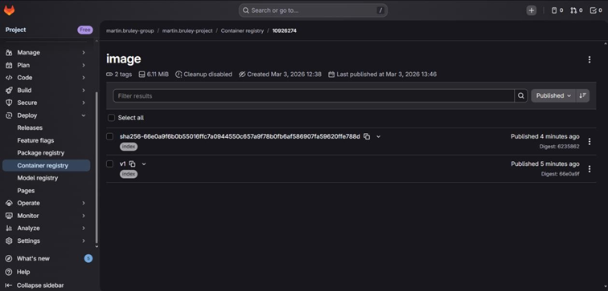
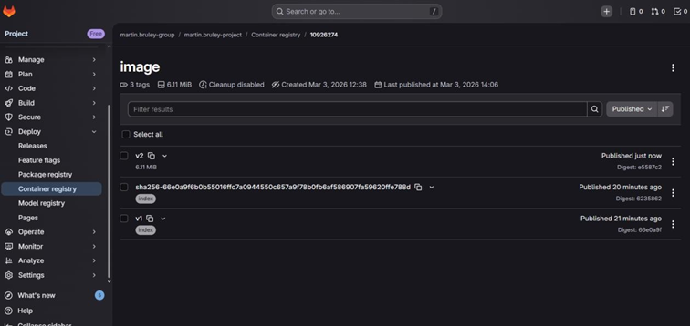
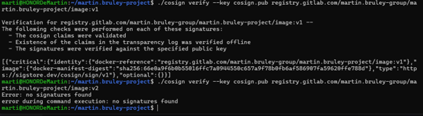
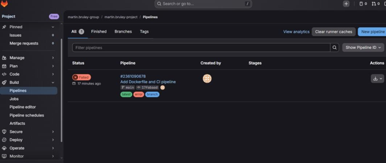
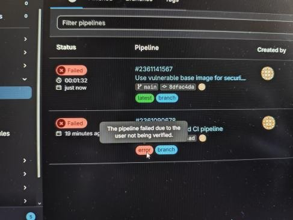
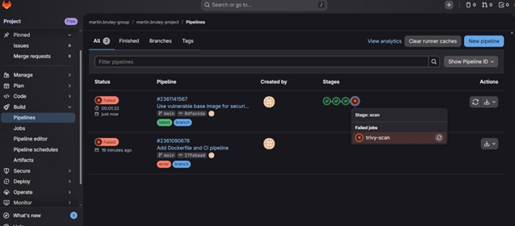

# ECE

**Major: Cybersecurity International**

---

**Course**  
*Sécurité des Containers*

**Lab Report**  
Session 4

**Instructor**  
Etienne LOUTSCH

**Group Members**
- ARDILLON Bastian
- SAVEAUX Octave
- BRULEY Martin

**Date**  
March 3, 2026

---
<div style="page-break-after: always;"></div>


## Activités Pratiques

### Signature d'images avec Cosign

Nous avons installé Cosign et généré une paire de clés de signature :

```bash
curl -sSfL https://github.com/sigstore/cosign/releases/latest/download/cosign-linux-amd64 -o cosign
chmod +x cosign
./cosign generate-key-pair
```

Nous avons ensuite construit l'image `v1`, effectué le login au registry GitLab avec un Personal Access Token, puis poussé l'image :

```bash
docker build -t registry.gitlab.com/martin.bruley-group/martin.bruley-project/image:v1 .
docker login registry.gitlab.com
docker push registry.gitlab.com/martin.bruley-group/martin.bruley-project/image:v1
```

Nous avons signé l'image `v1` avec Cosign :

```bash
./cosign sign --key cosign.key registry.gitlab.com/martin.bruley-group/martin.bruley-project/image:v1
```

On peut observer que la signature est bien associée à `v1` dans le Container Registry GitLab :



<div style="page-break-after: always;"></div>

Pour simuler une compromission, nous avons créé une image `v2` modifiée (ajout d'un fichier `/tampered`) sans la re-signer :

```bash
docker run --name tampered-test registry.gitlab.com/martin.bruley-group/martin.bruley-project/image:v1 touch /tampered
docker commit tampered-test registry.gitlab.com/martin.bruley-group/martin.bruley-project/image:v2
docker push registry.gitlab.com/martin.bruley-group/martin.bruley-project/image:v2
docker rm tampered-test
```

Dans le registry, la signature reste attachée à `v1` uniquement :



Nous avons vérifié les signatures avec la clé publique :

```bash
./cosign verify --key cosign.pub registry.gitlab.com/martin.bruley-group/martin.bruley-project/image:v1
./cosign verify --key cosign.pub registry.gitlab.com/martin.bruley-group/martin.bruley-project/image:v2
```

La vérification réussit pour `v1` et échoue avec `no signatures found` pour `v2`, confirmant que toute modification faite après la signature est détectée :




---
<div style="page-break-after: always;"></div>


### Sécurité dans les Pipelines CI/CD avec GitLab CI

Nous avons créé un pipeline `.gitlab-ci.yml` composé de quatre stages : `lint`, `build`, `verify` et `scan`.

- **lint** (`hadolint-scan`) : analyse le Dockerfile avec Hadolint pour détecter les mauvaises pratiques.
- **build** (`build-image`) : construit l'image, la pousse dans le registry GitLab, puis la signe automatiquement avec Cosign (signature keyless via Sigstore).
- **verify** (`verify_image`) : vérifie que l'image est bien signée par ce pipeline via l'identité OIDC GitLab.
- **scan** (`trivy-scan`) : scanne l'image avec Trivy et fait échouer le pipeline si des vulnérabilités HIGH ou CRITICAL sont détectées.

Lors du premier `git push`, la pipeline a échoué en raison d'une vérification de compte GitLab manquante :





Une fois le compte vérifié, nous avons testé le pipeline avec une image volontairement vulnérable :

```dockerfile
FROM alpine:3.12
RUN apk add --no-cache curl=7.79.1-r1
```

Les stages `lint`, `build` et `verify` passent avec succès. Le stage `scan` échoue : Trivy détecte des vulnérabilités HIGH/CRITICAL dans Alpine 3.12 et `curl=7.79.1-r1`, et l'option `--exit-code 1` bloque la pipeline :


